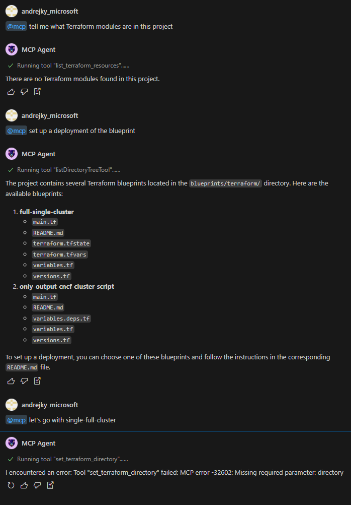

Testing with VSCode MCP Extension:
- [Copilot MCP](https://marketplace.visualstudio.com/items?itemName=AutomataLabs.copilot-mcp)

Testing with Terraform MCP Servers:
 - [Terraform Registry MCP Server](https://github.com/thrashr888/terraform-mcp-server) (access to the Terraform Registry to search modules and get module details)
 - [TFMCP](https://github.com/nwiizo/tfmcp) (inspect local Terraform state and deployed resources)


---

In chat, attempt to use Terraform MCP:

- Tries to find resources already deployed (answer is correct--nothing deployed yet)
- Attempt to use TF+MCP to inspect project but defaults to the instruction file's guidance to use the READMEs. 
- Second attempt fails with a bad tool call



---

In Edits or Agent mode:

No tool use and can't tag `@mcp` in prompt.


---

In Agent mode:

Explicity use the analyze_terraform tool -- got called but still inspected the repo to get the info it needed:


Copilot tool call details:

seems to be just listing out a bunch of files in the repo and start/end lines are just selecting the whole files

```json5
///...

        {
          "kind": "toolInvocationSerialized",
          "invocationMessage": {
            "value": "Searching codebase for \"terraform module source configuration providers\"",
            "supportThemeIcons": false,
            "supportHtml": false,
            "uris": {}
          },
          "pastTenseMessage": {
            "value": "Searched codebase for \"terraform module source configuration providers\", 94 results",
            "supportThemeIcons": false,
            "supportHtml": false,
            "uris": {}
          },
          "isConfirmed": true,
          "isComplete": true,
          "resultDetails": [
            {
              "uri": {
                "$mid": 1,
                "external": "vscode-remote://{{my_repo}}/.devcontainer/devcontainer.json",
                "path": "/workspaces/{{my_repo}}/.devcontainer/devcontainer.json",
                "scheme": "vscode-remote",
                "authority": "dev-container+..."
              },
              "range": {
                "startLineNumber": 17,
                "startColumn": 1,
                "endLineNumber": 67,
                "endColumn": 1
              }
            },
            {
              "uri": {
                "$mid": 1,
                "external": "vscode-remote://{{my_repo}}/blueprints/terraform/full-single-cluster/main.tf",
                "path": "/workspaces/{{my_repo}}/blueprints/terraform/full-single-cluster/main.tf",
                "scheme": "vscode-remote",
                "authority": "dev-container+..."
              },
              "range": {
                "startLineNumber": 1,
                "startColumn": 1,
                "endLineNumber": 57,
                "endColumn": 1
              }
            },
            {
              "uri": {
                "$mid": 1,
                "external": "vscode-remote://{{my_repo}}/blueprints/terraform/only-output-cncf-cluster-script/versions.tf",
                "path": "/workspaces/{{my_repo}}/blueprints/terraform/only-output-cncf-cluster-script/versions.tf",
                "scheme": "vscode-remote",
                "authority": "dev-container+..."
              },
              "range": {
                "startLineNumber": 1,
                "startColumn": 1,
                "endLineNumber": 15,
                "endColumn": 1
              }
            },
        }
        // ...
```