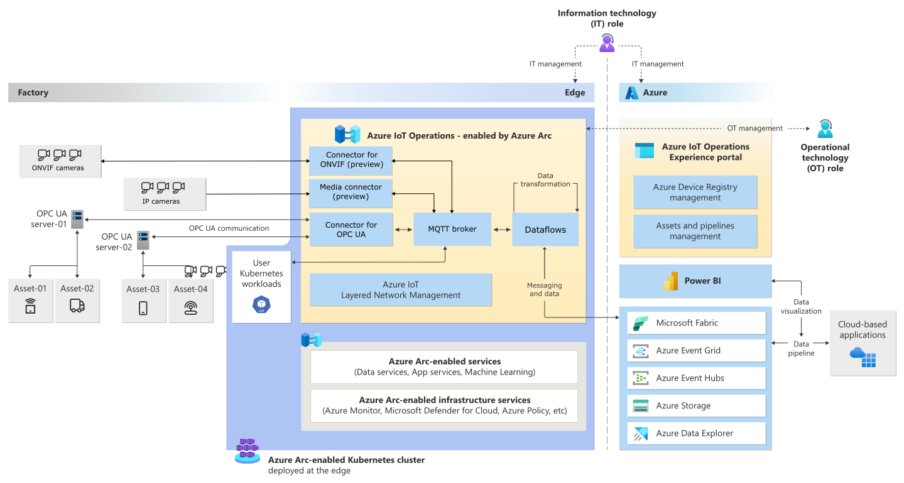

# Architecture Diagram Image -> Markdown: Azure IOT Reference Architcture

Guidance from [AIO reference architecture](https://learn.microsoft.com/en-us/azure/iot-operations/overview-iot-operations) used as a test for models and prompting:

- [Gemini 2.0 Flash - Low](aio-ref-gemini-2-flash-v1.md)
- [Claude Sonnet 3.7 Reasoning - Low](aio-ref-claude-37-reasoning-low-v1.md)
- [Claude Sonnet 3.7 Reasoning - High](aio-ref-claude-37-reasoning-high-v1.md)
