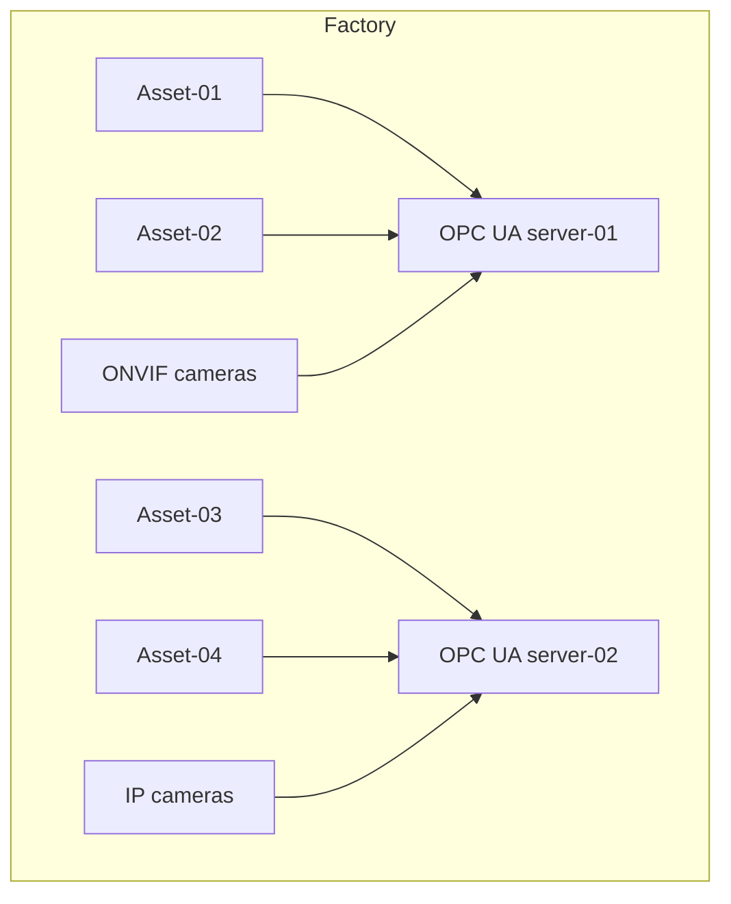
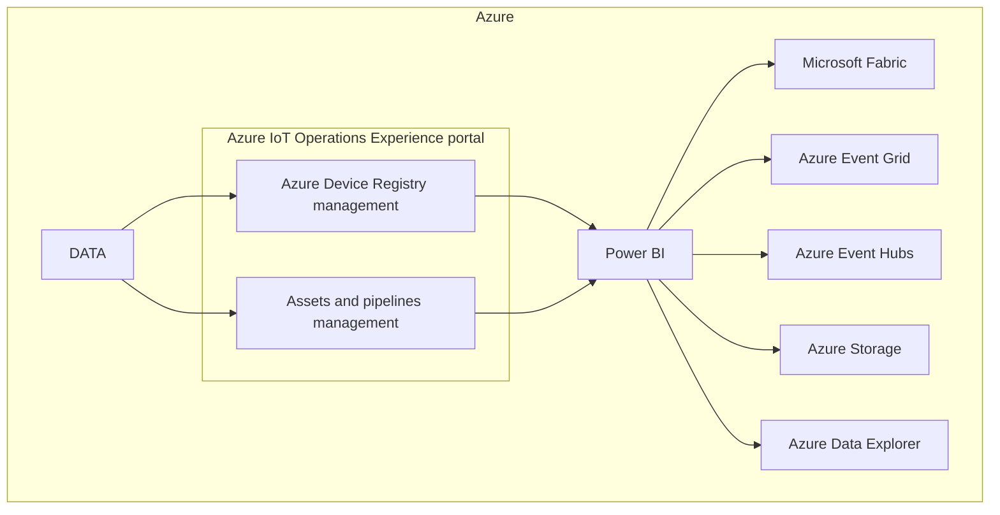
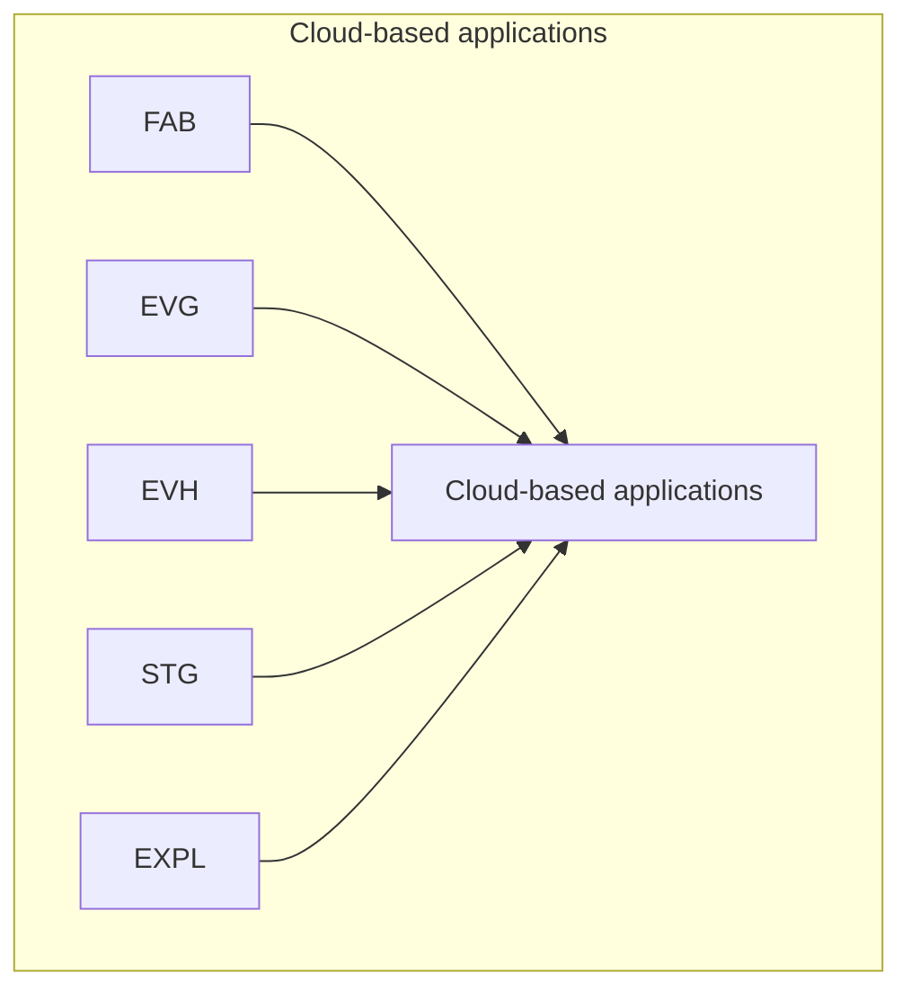

# Detailed Design Document

## Overview

This document describes the architecture for an IoT solution enabled by Azure Arc. The architecture is divided into several layers, each representing different components and their interactions.

## Layers of Architecture

### 1. Factory Layer

This layer includes various assets and cameras within the factory.



### 2. Edge Layer

This layer includes Azure IoT Operations enabled by Azure Arc, user Kubernetes workloads, and Azure Arc-enabled Kubernetes cluster.

```mermaid
graph TD
    subgraph Edge
        subgraph Azure IoT Operations
            CONN1[Connector for ONVIF (preview)]
            CONN2[Media connector (preview)]
            CONN3[Connector for OPC UA]
            MQTT[MQTT broker]
            DATA[Dataflows]
            LAYER[Azure IoT Layered Network Management]
            
            CONN1 --> MQTT
            CONN2 --> MQTT
            CONN3 --> MQTT
            MQTT --> DATA
            DATA --> LAYER
        end
        
        K8S[User Kubernetes workloads]
        ARC[Azure Arc-enabled Kubernetes cluster]
        
        OPC1 --> CONN3
        OPC2 --> CONN3
        K8S --> ARC
    end
```

### 3. Azure Layer

This layer includes various Azure services and the Azure IoT Operations Experience portal.



### 4. Cloud-based Applications

This layer includes cloud-based applications that interact with the Azure services.



## Relationships Between Layers

- The Factory layer communicates with the Edge layer through OPC UA communication.
- The Edge layer processes data and manages network operations using Azure IoT Operations and Kubernetes workloads.
- The Azure layer provides various services for device registry, asset management, data visualization, and data pipelines.
- Cloud-based applications interact with Azure services for further data processing and visualization.

## Conclusion

This document provides a detailed overview of the architecture for the IoT solution enabled by Azure Arc. Each layer is described with its components and their relationships, represented using mermaid diagrams for clarity.