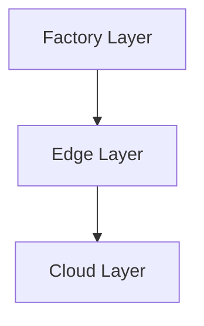
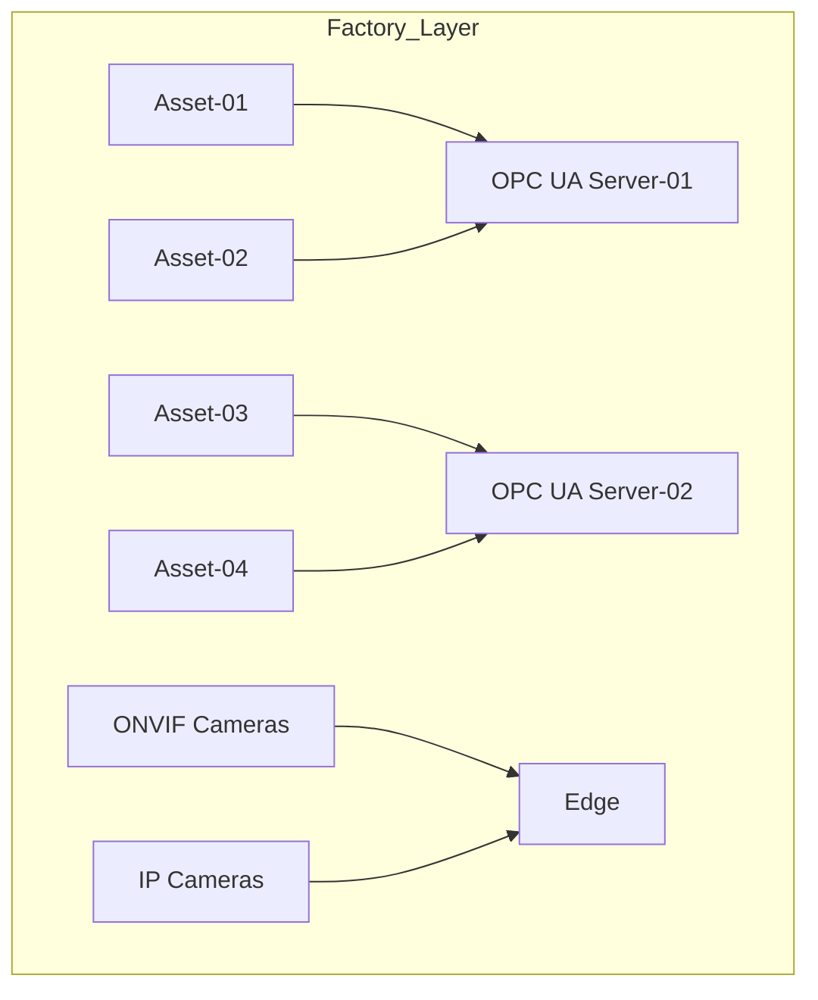
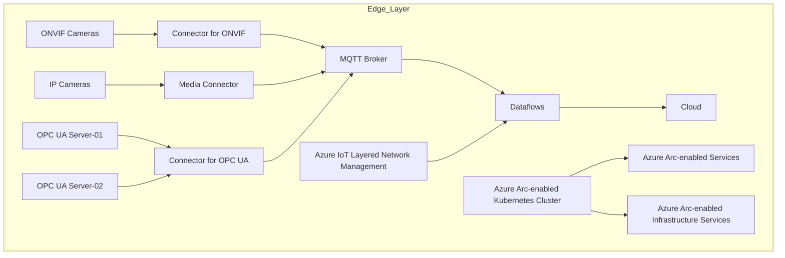
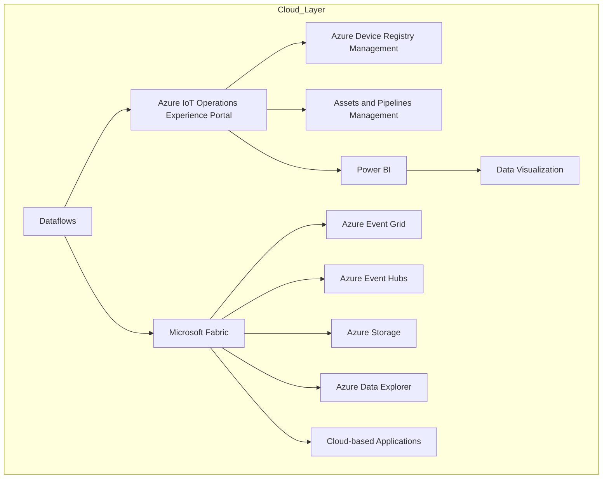

```markdown
# Detailed Design Document for Azure IoT Operations Architecture

This document provides a detailed breakdown of the architecture depicted in the provided diagram. The architecture is organized into layers and subsystems, with components and their relationships described in detail. Mermaid diagrams are included to visualize the structure and relationships between components.

---

## Table of Contents
1. [Overview](#overview)
2. [Factory Layer](#factory-layer)
3. [Edge Layer](#edge-layer)
4. [Cloud Layer](#cloud-layer)
5. [Mermaid Diagrams](#mermaid-diagrams)

---

## Overview

The architecture is designed to enable IoT operations using Azure IoT and Azure Arc. It integrates factory assets, edge computing, and cloud services to provide data transformation, visualization, and management capabilities. The system is divided into three main layers:
- **Factory Layer**: Contains physical assets and cameras.
- **Edge Layer**: Processes data locally using Azure IoT Operations and Azure Arc-enabled Kubernetes.
- **Cloud Layer**: Provides centralized management, data storage, and visualization.

---

## Factory Layer

The **Factory Layer** consists of physical assets and cameras that generate data. These components communicate with the Edge Layer for further processing.

### Components:
1. **Assets**:
   - Asset-01
   - Asset-02
   - Asset-03
   - Asset-04
2. **OPC UA Servers**:
   - OPC UA Server-01
   - OPC UA Server-02
3. **Cameras**:
   - ONVIF Cameras
   - IP Cameras

### Relationships:
- Assets communicate with OPC UA Servers using OPC UA communication.
- Cameras (ONVIF and IP) send data directly to the Edge Layer.

---

## Edge Layer

The **Edge Layer** processes data locally using Azure IoT Operations and Azure Arc-enabled Kubernetes. It acts as the intermediary between the Factory Layer and the Cloud Layer.

### Components:
1. **Azure IoT Operations**:
   - Connector for ONVIF (Preview)
   - Media Connector (Preview)
   - Connector for OPC UA
   - MQTT Broker
   - Dataflows
   - Azure IoT Layered Network Management
2. **Azure Arc-enabled Kubernetes Cluster**:
   - Hosts user Kubernetes workloads.
   - Deploys Azure Arc-enabled services and infrastructure services.

### Relationships:
- Cameras and OPC UA Servers send data to Azure IoT Operations connectors.
- Dataflows handle data transformation and messaging.
- Azure IoT Layered Network Management manages network communication.
- Azure Arc-enabled Kubernetes hosts workloads and services.

---

## Cloud Layer

The **Cloud Layer** provides centralized management, data storage, and visualization capabilities. It integrates with the Edge Layer to process and visualize data.

### Components:
1. **Azure IoT Operations Experience Portal**:
   - Azure Device Registry Management
   - Assets and Pipelines Management
2. **Power BI**:
   - Provides data visualization.
3. **Microsoft Fabric**:
   - Supports data pipelines.
4. **Azure Services**:
   - Azure Event Grid
   - Azure Event Hubs
   - Azure Storage
   - Azure Data Explorer
5. **Cloud-based Applications**:
   - Consume data pipelines for further processing.

### Relationships:
- Dataflows from the Edge Layer send data to Azure IoT Operations Experience Portal.
- Power BI visualizes data from Azure IoT Operations.
- Microsoft Fabric and Azure services handle data pipelines and storage.
- Cloud-based applications consume processed data.

---

## Mermaid Diagrams

### Top-Level Architecture


### Factory Layer


### Edge Layer


### Cloud Layer


---

## Summary

This document provides a detailed breakdown of the architecture, including its components, structure, and relationships. The layered approach ensures modularity and scalability, with clear separation of responsibilities between the Factory, Edge, and Cloud layers.
```