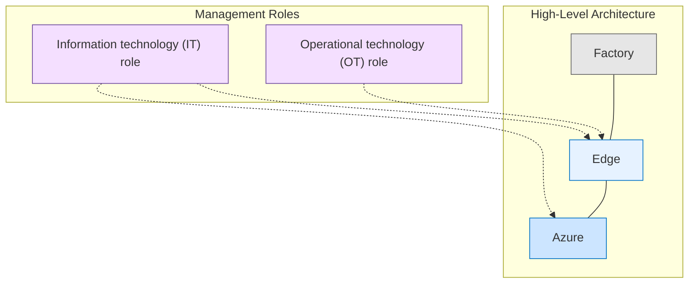
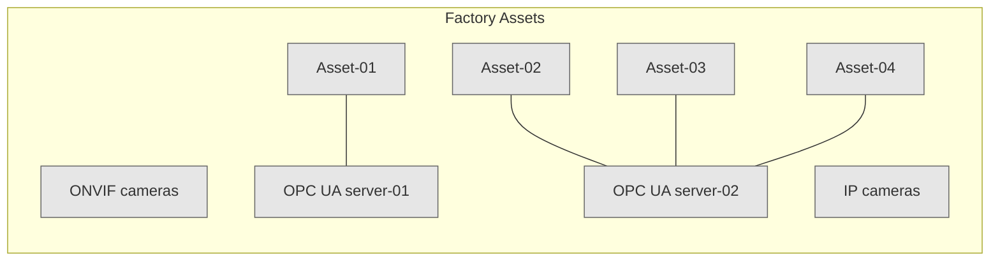
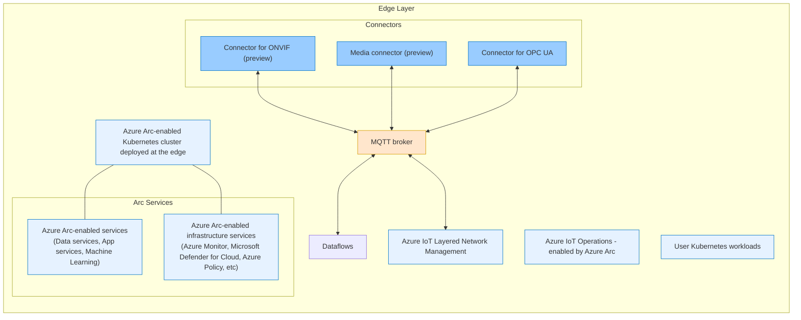
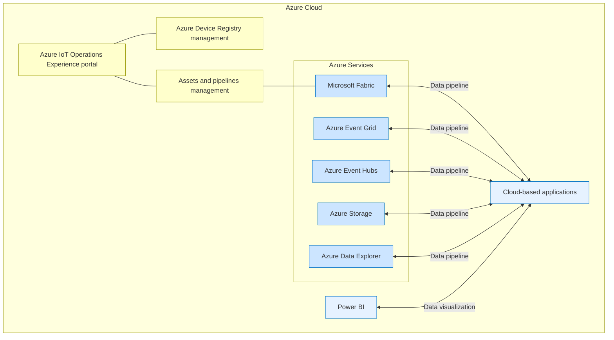

# Azure IoT Operations Architecture Design Document

## 1. Overview

This document describes the architecture for an Azure IoT Operations solution spanning from factory assets to cloud services. The architecture consists of three primary domains: Factory, Edge, and Azure cloud, with distinct IT and OT management roles.

## 2. Factory Layer

The factory layer contains physical assets and industrial control systems that produce operational data.

### 2.1 Factory Components

- **ONVIF cameras**: Standard IP cameras using the ONVIF protocol
- **IP cameras**: Generic IP-based cameras
- **OPC UA servers**:
  - OPC UA server-01: Connected to Asset-01
  - OPC UA server-02: Connected to Asset-02, Asset-03, and Asset-04
- **Assets**:
  - Asset-01: Factory equipment (appears to be a computer/server)
  - Asset-02: Factory equipment (appears to be industrial equipment)
  - Asset-03: Factory equipment (appears to be a mobile device)
  - Asset-04: Factory equipment (appears to be a networking device)

## 3. Edge Layer

The edge layer processes factory data locally before sending it to the cloud, using Azure IoT Operations enabled by Azure Arc.

### 3.1 Edge Components

- **Azure IoT Operations - enabled by Azure Arc**: Core edge processing platform
  - **Connectors**:
    - Connector for ONVIF (preview): Interfaces with ONVIF cameras
    - Media connector (preview): Processes media streams
    - Connector for OPC UA: Interfaces with OPC UA servers via OPC UA communication
  - **MQTT broker**: Central message broker handling data from connectors
  - **Dataflows**: Processes data transformations
  - **Azure IoT Layered Network Management**: Manages network connectivity for IoT devices
  
- **User Kubernetes workloads**: Custom containerized applications running at the edge

- **Azure Arc-enabled Kubernetes cluster deployed at the edge**: Kubernetes infrastructure managed by Azure Arc

- **Azure Arc-enabled services**:
  - Data services, App services, Machine Learning
  - Infrastructure services: Azure Monitor, Microsoft Defender for Cloud, Azure Policy, etc.

## 4. Azure Cloud Layer

The Azure cloud layer provides management, analytics, and storage capabilities for IoT data.

### 4.1 Azure Components

- **Azure IoT Operations Experience portal**: Management interface for IoT operations
  - **Azure Device Registry management**: Device identity and management
  - **Assets and pipelines management**: Manages industrial assets and data flows

- **Cloud Processing Services**:
  - **Microsoft Fabric**: Unified analytics platform
  - **Azure Event Grid**: Event routing service
  - **Azure Event Hubs**: Big data streaming platform
  - **Azure Storage**: Scalable cloud storage
  - **Azure Data Explorer**: Data exploration service
  - **Power BI**: Business intelligence and visualization tools

- **Cloud-based applications**: Custom applications consuming IoT data

## 5. Cross-Layer Relationships

The architecture shows key integration patterns between layers:

1. **Factory to Edge**:
   - ONVIF cameras connect to ONVIF connector
   - IP cameras connect to Media connector
   - OPC UA servers connect to OPC UA connector via OPC UA communication

2. **Edge Processing**:
   - Connectors feed data to MQTT broker
   - MQTT broker connects to Dataflows for transformation
   - Dataflows handle messaging and data preparation

3. **Edge to Cloud**:
   - Processed data flows from Edge to Azure services
   - Management is bidirectional:
     - IT management spans both Edge and Azure environments
     - OT management focuses on Edge operations

4. **Data Pipeline**:
   - Edge data transforms flow to cloud services
   - Azure services provide data pipeline capabilities
   - Power BI provides visualization of processed data
   - Cloud applications consume the processed data

The architecture provides a complete IoT solution from industrial assets to cloud analytics, with edge processing to optimize data transmission and enable local operations.