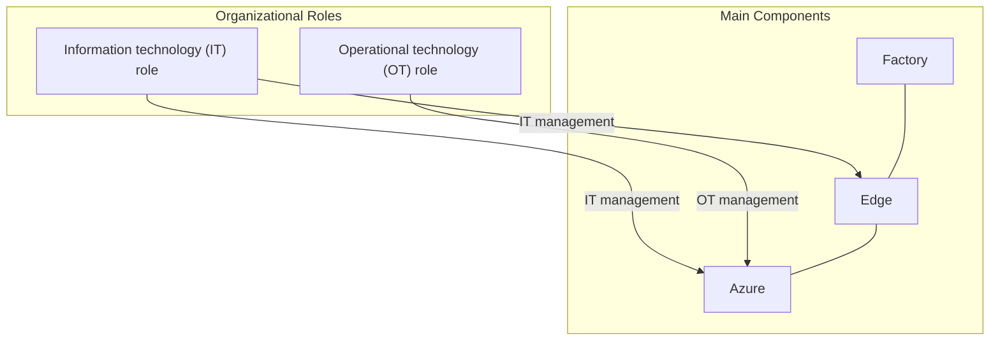
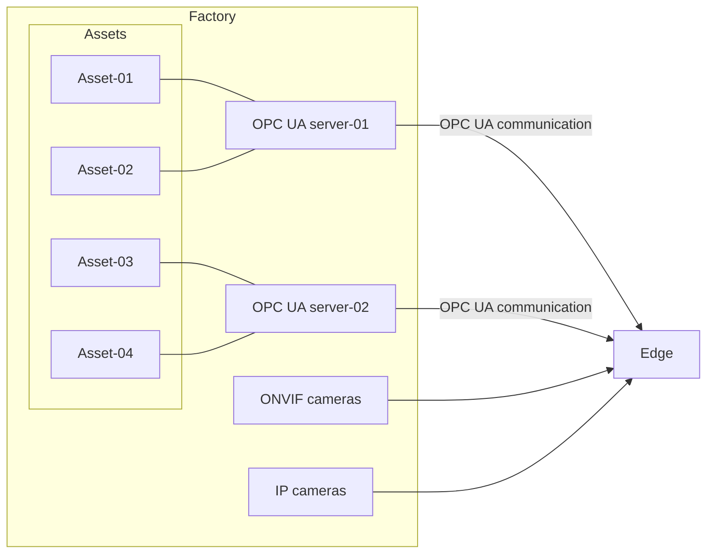
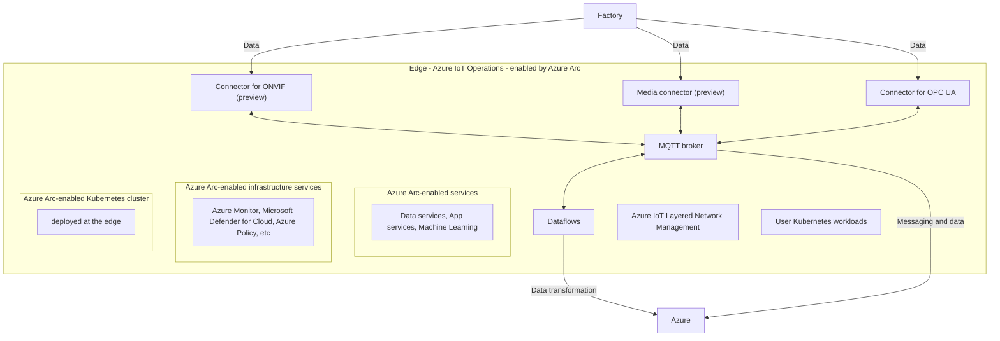
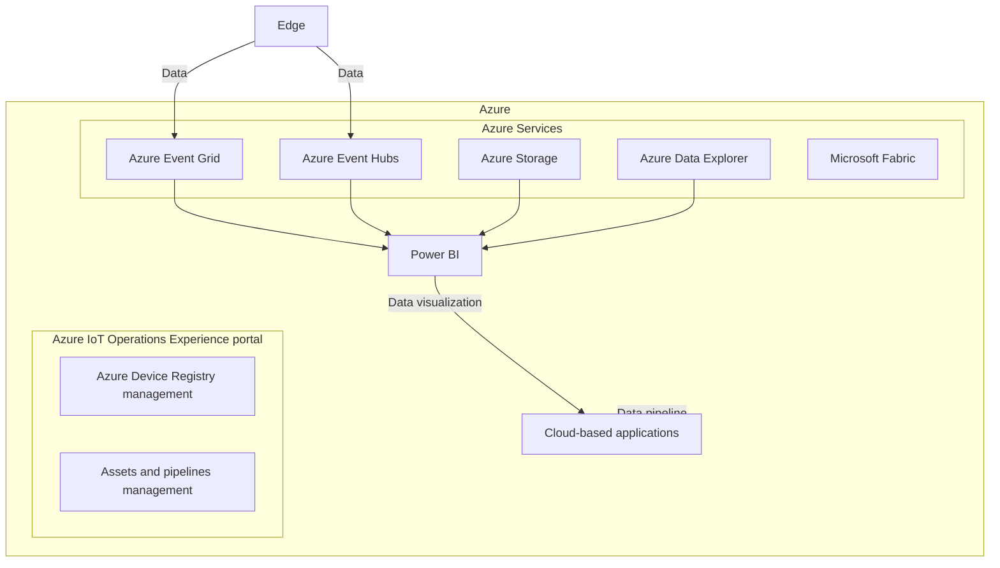

# Azure IoT Operations Architecture Design Document

This document describes the architecture for an Azure IoT Operations solution that connects factory systems to the Azure cloud. The architecture spans from operational technology (OT) assets in the factory through edge computing to cloud services.

## 1. High-Level Architecture Overview

The architecture consists of three main layers:

- **Factory Layer**: Physical devices and assets in the operational environment
- **Edge Layer**: Azure IoT Operations running at the edge, enabled by Azure Arc
- **Azure Cloud Layer**: Cloud services for data processing, storage, and visualization

### High-Level Architecture Diagram

## 2. Factory Layer

The factory layer contains the operational technology assets that generate data, including various cameras, OPC UA servers, and connected devices.

### Factory Components Diagram

## 3. Edge Layer

The edge layer consists of Azure IoT Operations components running at the edge, enabled by Azure Arc. This layer connects to factory systems, processes data, and communicates with the cloud.

### Edge Components Diagram

## 4. Azure Cloud Layer

The Azure cloud layer provides services for device management, data processing, analytics, and visualization.

### Azure Cloud Components Diagram

## 5. Component Details

### Factory Components

- **ONVIF cameras**: Standard protocol cameras for video monitoring
- **IP cameras**: Network cameras for video monitoring
- **OPC UA server-01**: OPC Unified Architecture server connecting to Asset-01 and Asset-02
- **OPC UA server-02**: OPC Unified Architecture server connecting to Asset-03 and Asset-04
- **Asset-01, Asset-02, Asset-03, Asset-04**: Physical operational assets in the factory

### Edge Components

- **Connector for ONVIF (preview)**: Connects to ONVIF-compliant cameras
- **Media connector (preview)**: Processes media streams from IP cameras
- **Connector for OPC UA**: Interfaces with OPC UA servers for industrial communications
- **MQTT broker**: Message broker for pub/sub communication patterns
- **Dataflows**: Processes and transforms data before sending to the cloud
- **Azure IoT Layered Network Management**: Manages network communication for IoT devices
- **User Kubernetes workloads**: Custom containerized applications running at the edge
- **Azure Arc-enabled Kubernetes cluster**: Kubernetes deployment managed by Azure Arc
- **Azure Arc-enabled services**: Cloud services running at the edge, including data services, app services, and machine learning
- **Azure Arc-enabled infrastructure services**: Monitoring and security services including Azure Monitor, Microsoft Defender for Cloud, Azure Policy, etc.

### Azure Cloud Components

- **Azure IoT Operations Experience portal**: Management interface for IoT operations
  - **Azure Device Registry management**: Manages device identities and properties
  - **Assets and pipelines management**: Manages asset definitions and data pipelines
- **Power BI**: Business intelligence and data visualization tool
- **Microsoft Fabric**: Analytics platform for data processing
- **Azure Event Grid**: Event routing service
- **Azure Event Hubs**: Big data streaming platform
- **Azure Storage**: Cloud storage service
- **Azure Data Explorer**: Data exploration and analytics service
- **Cloud-based applications**: Applications consuming processed data

## 6. Management Roles

- **Information technology (IT) role**: Manages IT infrastructure, including Edge and Azure components
- **Operational technology (OT) role**: Manages operational technology assets and oversees the Azure IoT Operations Experience portal

This architecture enables seamless data flow from factory floor devices through edge processing to cloud services for analytics, visualization, and application integration.
