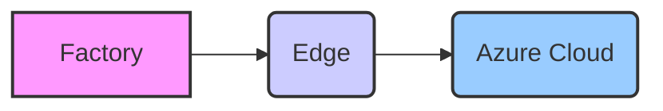
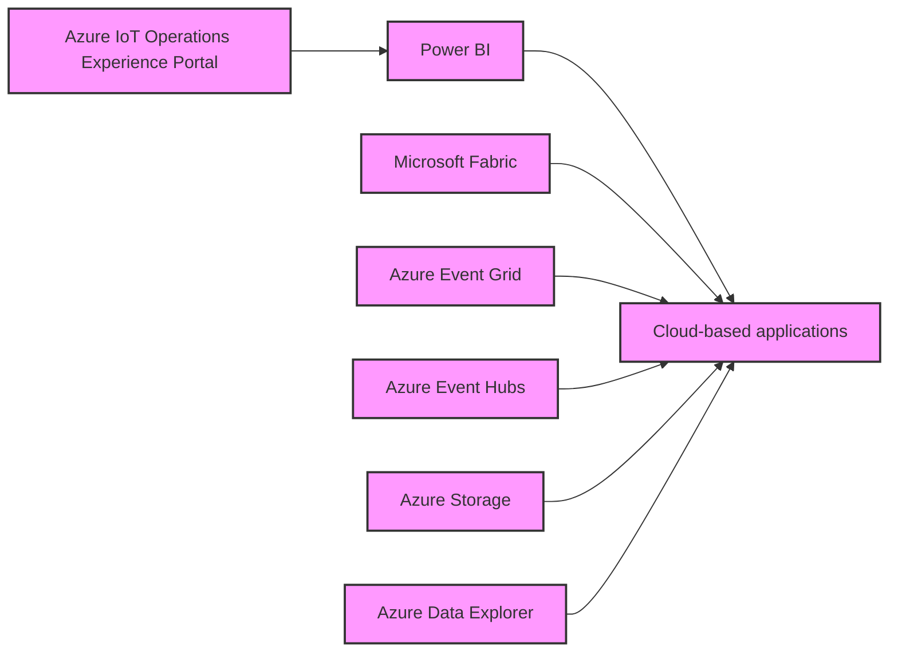

# Detailed Design Document: Azure IoT Edge Factory Architecture

This document outlines the detailed design for an Azure IoT Edge solution deployed in a factory environment, based on the provided architectural diagram.

## 1. Top-Level Architecture

This architecture is divided into three primary tiers, representing the flow of data from the factory floor to the cloud:

- **Factory:** Represents the physical factory environment, including assets, sensors, and edge servers.
- **Edge:** The edge computing layer, powered by Azure IoT Operations enabled by Azure Arc. It processes data locally.
- **Azure Cloud:** Represents the cloud-based services for data processing, storage, visualization, and management.

Here is a high-level diagram to help visualize the layers:



## 2. Factory Layer

The Factory Layer represents the physical components and data sources within the factory.

### 2.1. Components

- **ONVIF Cameras:** Cameras supporting the ONVIF standard.
- **IP Cameras:** Standard IP-based cameras.
- **OPC UA Servers (server-01, server-02):** OPC UA servers collecting data from industrial equipment.
- **Assets (Asset-01, Asset-02, Asset-03, Asset-04):** Represent various physical assets within the factory.
- **User Kubernetes Workloads:** Kubernetes workloads running at the edge, close to the data source.

### 2.2. Relationships

- ONVIF and IP Cameras capture visual data from the factory floor.
- OPC UA Servers collect data from Assets via OPC UA communication.
- User Kubernetes workloads consume data from the local factory environment.

## 3. Edge Layer

The Edge Layer is powered by "Azure IoT Operations - enabled by Azure Arc". It processes data locally before sending it to the cloud.

### 3.1. Components

- **Azure Arc-enabled Kubernetes Cluster:** The foundation of the edge layer, providing a container orchestration platform.
- **Azure IoT Operations - enabled by Azure Arc**
  - **Connector for ONVIF (preview):** Connects to ONVIF cameras.
  - **Media Connector (preview):** Processes media streams from cameras.
  - **Connector for OPC UA:** Connects to OPC UA servers.
  - **MQTT Broker:** A message broker for MQTT communication.
  - **Dataflows:** Processes and transforms data.
  - **Azure IoT Layered Network Management:** Manages network configurations and security.
- **Azure Arc-enabled Services:**
  - Data services (e.g., databases)
  - App services
  - Machine Learning services
- **Azure Arc-enabled Infrastructure Services:**
  - Azure Monitor
  - Microsoft Defender for Cloud
  - Azure Policy

### 3.2. Relationships

```mermaid
graph LR
    subgraph Azure IoT Operations - enabled by Azure Arc
    A[Connector for ONVIF (preview)]
    B[Media Connector (preview)]
    C[Connector for OPC UA]
    D[MQTT Broker]
    E[Dataflows]
    F[Azure IoT Layered Network Management]
    end
    A --> D
    B --> D
    C --> D
    D --> E
    E --> F
    style A fill:#f9f,stroke:#333,stroke-width:2px
    style B fill:#f9f,stroke:#333,stroke-width:2px
    style C fill:#f9f,stroke:#333,stroke-width:2px
    style D fill:#f9f,stroke:#333,stroke-width:2px
    style E fill:#f9f,stroke:#333,stroke-width:2px
    style F fill:#f9f,stroke:#333,stroke-width:2px
```

- The ONVIF Connector and Media Connector receive data from ONVIF and IP Cameras, respectively.
- The OPC UA Connector retrieves data from OPC UA Servers.
- All connectors send data to the MQTT Broker.
- Dataflows receive data from the MQTT broker and perform transformations.
- Azure IoT Layered Network Management is for messaging and data transfer from the dataflows.

## 4. Azure Cloud Layer

The Azure Cloud Layer provides cloud-based services for data processing, storage, visualization, and management.

### 4.1. Components

- **Azure:** Overall Azure Cloud Platform.
- **Azure IoT Operations Experience Portal:** A portal for managing Azure IoT Operations.
  - Azure Device Registry Management
  - Assets and Pipelines Management
- **Power BI:** For data visualization.
- **Microsoft Fabric:** A data analytics platform.
- **Azure Event Grid:** An event routing service.
- **Azure Event Hubs:** A scalable event ingestion service.
- **Azure Storage:** Cloud storage.
- **Azure Data Explorer:** A data exploration service.
- **Cloud-based applications**

### 4.2. Relationships



- Data flows from the Edge Layer to various Azure services.
- Azure IoT Operations Experience portal enables managing the edge deployment.
- Power BI provides data visualization from processed data.
- Microsoft Fabric, Azure Event Grid, Azure Event Hubs, Azure Storage, and Azure Data Explorer all act as sources for Cloud-based applications.

## 5. Roles and Responsibilities

- **Information Technology (IT) Role:** Responsible for IT management of the Azure cloud and edge infrastructure.
- **Operational Technology (OT) Role:** Responsible for OT management within the Azure IoT Operations Experience portal.

## 6. Data Flow

1.  Data originates from factory assets (cameras, OPC UA servers).
2.  Data is ingested and processed by the Azure IoT Operations components on the Edge.
3.  Transformed data is sent to the Azure Cloud.
4.  Data is visualized and analyzed using Power BI, Microsoft Fabric, and other Azure services.
5.  Cloud-based applications consume the data from other Azure services.

```

This markdown file provides a structured overview of the architecture depicted in the image. The Mermaid diagrams help to visualize the relationships between different components within each layer. Remember that this document is based solely on the image provided, without any additional assumptions or modifications.
```
